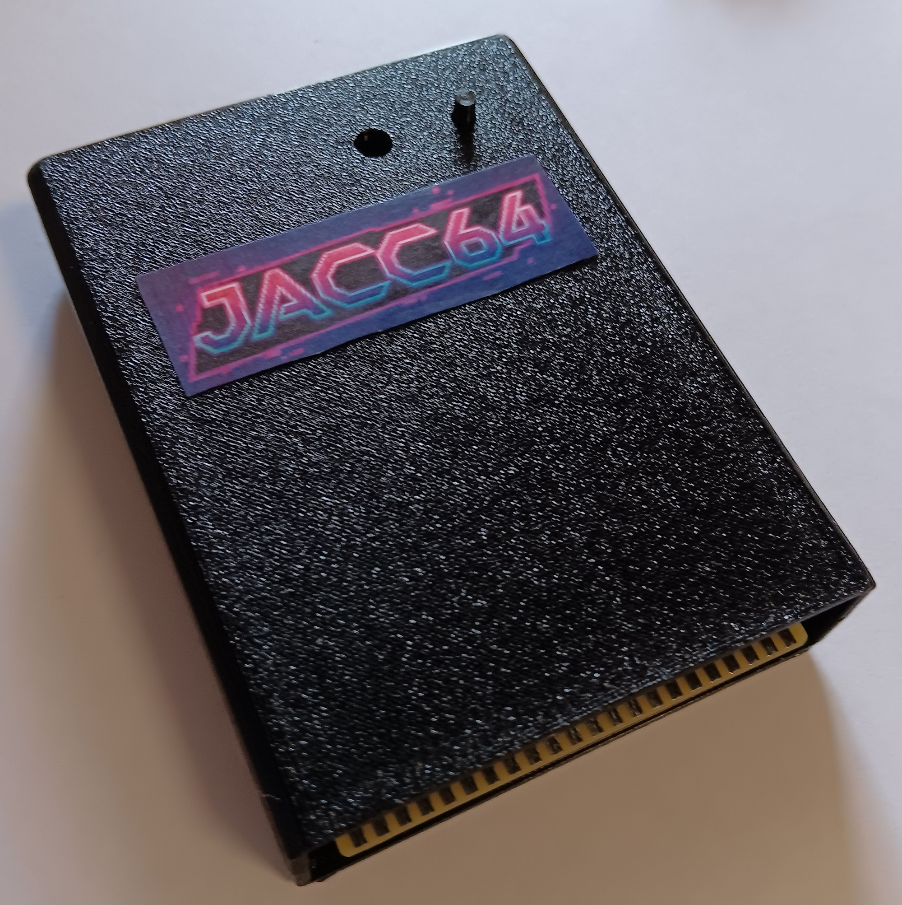
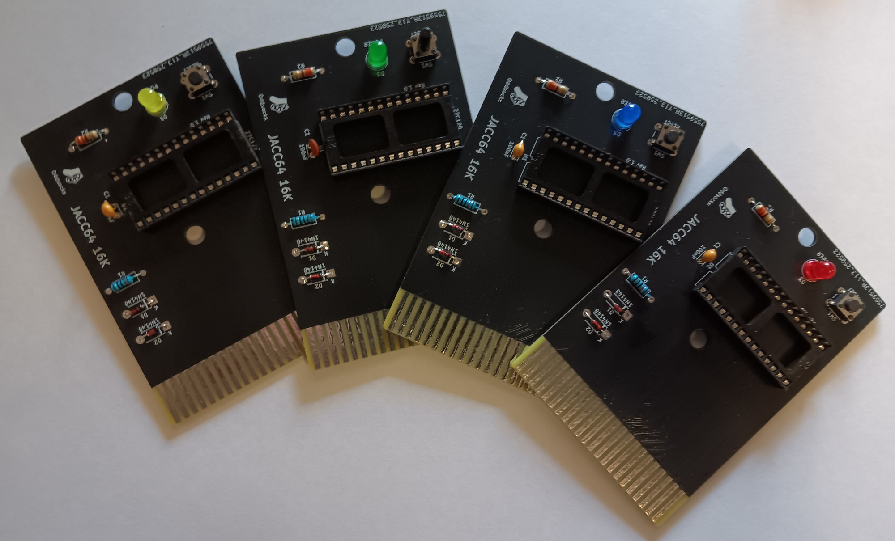

# JACC64-16K

## Description
JACC64-16K: Just Another Commodore Cartridge.

A simple ROM cartridge for the Commodore 64 which takes a single 16K ROM image in an EPROM/EEPROM. Thanks to [World of Jani](https://blog.worldofjani.com/?p=879) for the original circuit design.

**Features**
* Power LED
* Reset Switch

## Bill of Materials

| Qty | Component                          |
|:---:|------------------------------------|
| 1   | 5mm LED                            |
| 1   | 6x6mm Tactile Push Button          |
| 1   | 330Ω Axial Resistor - ¼ watt (LED) |
| 1   | 10KΩ Axial Resistor - ¼ watt       |
| 2   | 1N4148 Diodes                      |
| 1   | 100nF Ceramic Capacitor            |
| 1   | M27C128 EPROM (or compatible)      |

* IC Sockets are optional.
* The LED resistor is nominally 330Ω but anything up to 1K is fine
* You will need to burn the 16K ROM image to the EPROM/EEPROM using a suitable programmer.
* Larger EPROMs/EEPROMs can be used but be sure to repeat the image to fill up the ROM.

## 3D Printable Case
A 3D printable case specifically designed for this PCB is also available. STLs are included in this repo.

* Insert the PCB into the base part of the case, making sure the holes in the PCB are aligned with the screw posts.
* Insert the reset pin into the top part of the case, then align it with the bottom part of the case.
* Use 2 x 3.5mm self-tapping screws to screw the case parts together. Max length about 15mm.

## Support Me
Everything is freely available so you can make your own PCB and case, however if you would like to support me, please see the following links.

* [My Projects](https://projects.amiga-hardware.com) - Donate on this page
* [Order the JACC64-16K PCB](https://www.pcbway.com/project/shareproject/JACC64_16K_C64_Cartridge_8e199b4f.html)
* [Order the JACC64-16K Case](https://www.pcbway.com/project/shareproject/JACC64_16K_C64_Cartridge_Case_78ec0fd1.html)
